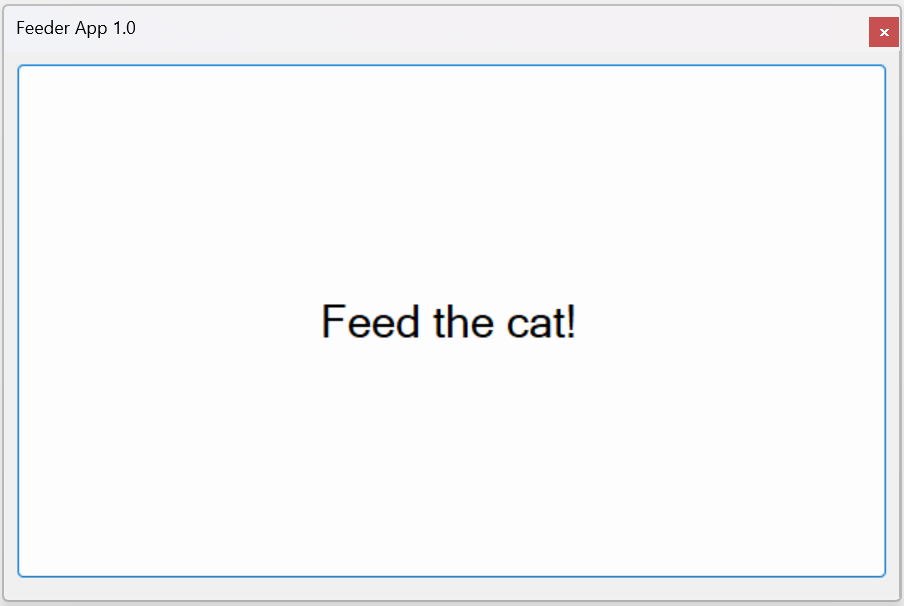

# The history of UI architecture design approaches: from Code-behind to MVVM

By Fedor Reznik

- [The history of UI architecture design approaches: from Code-behind to MVVM](#the-history-of-ui-architecture-design-approaches-from-code-behind-to-mvvm)
  - [1 Preface](#1-preface)
    - [1.1 The Purpose](#11-the-purpose)
    - [1.2 Domain](#12-domain)
    - [1.3 First User Story](#13-first-user-story)
  - [2 Back In The Days. Code-behind](#2-back-in-the-days-code-behind)
    - [2.1 Code-behind "Pattern" Definition](#21-code-behind-pattern-definition)
    - [2.2 The Implementation](#22-the-implementation)
    - [2.3 Here Comes The Issues](#23-here-comes-the-issues)
    - [2.4 The Blasphemy](#24-the-blasphemy)
  - [3 Moving Towards Patterns](#3-moving-towards-patterns)
    - [3.1 The Driving Force Of Change](#31-the-driving-force-of-change)
    - [3.2 A Word About Patterns In This Article](#32-a-word-about-patterns-in-this-article)
  - [4 MVC](#4-mvc)
    - [4.1 Definition](#41-definition)
    - [4.2 Implementation](#42-implementation)
    - [4.3 Second User Story](#43-second-user-story)
    - [4.4 The Router](#44-the-router)
    - [4.5 The Assessment](#45-the-assessment)
  - [5 MVP](#5-mvp)
  - [6 MVVM](#6-mvvm)
  - [7 Conclusion](#7-conclusion)
    - [7.1 Modern State](#71-modern-state)
    - [7.2 Which Approach To Select?](#72-which-approach-to-select)

## 1 Preface

### 1.1 The Purpose 

&nbsp;&nbsp;&nbsp;&nbsp;The whole purpose of this article is to summarize author's experience with regard to UI development and how it evolved via .Net technologies prism. Thus this point of view is highly opinionated and doesn't pretend to be 100% truth. Neither it is historically correct - in the end the MVC pattern itself is older than .Net! We will try to focus on trade-offs of different approaches and why developers have moved from one to another - trying to reveal the idea(s) behind them.
</br>
&nbsp;&nbsp;&nbsp;&nbsp;To give more examples we will need some kind of "Business/Problem domain" wired through different solutions. The problem is if we select a complex one we will hide the ideas in KLOCs and KLOCs of code not related to the actual topic. If we select a simple one some of our arguments might seem a bit artificial and issues highlighted can look dubious or non-existing at all. Well, we will try to keep the domain as simple as it possible - so prepare your imagination to extend the pros and cons highlighted to more complex areas.

### 1.2 Domain

&nbsp;&nbsp;&nbsp;&nbsp;Let's imagine that we are running an automatic cat feeder business. Right now we are only providing hardware configured feeders - with physical buttons on device. Our engineering team has developed and integrated into device the bluetooth adapter, as well as provided corresponding driver, so the idea is to quickly provide application to control cat feeder remotely. 

### 1.3 First User Story

&nbsp;&nbsp;&nbsp;&nbsp;To quickly conquer the market we as the company must provide the simplest yet use-full desktop application: it should contain only "Feed the cat" button and should provide feedback if the feeding has been successful. So our UX team came-out with the following design:
 

And the status of feeding should be provided by modal dialog with success/fail message and OK button to close it.

## 2 Back In The Days. Code-behind

### 2.1 Code-behind "Pattern" Definition

&nbsp;&nbsp;&nbsp;&nbsp;Let's imagine that everything is happening around 2005 and our team has proven expertise in Windows Forms, as well as code-behind approach seems quick and easy to implement: just open the form designer in your IDE, put some controls on it, wire the event handlers with mouse click, put the code into handlers and you are done. So you can hardly call this a pattern, the better word would be a process.

### 2.2 The Implementation

&nbsp;&nbsp;&nbsp;&nbsp;The best part of this approach is that there is almost nothing to discuss, so the basic implementation can look like this (you can find the complete solution [here](./Code-behind/)), see [Main](./Code-behind/CodeBehind/Main.cs) file:
```C#
public partial class Main : Form
{
    // 1. Instantiating the driver. 
    private readonly ICatFeederDriver _catFeederDriver = new CatFeederDriver();
    private readonly TaskScheduler _uiScheduler;
    
    public Main()
    {
        InitializeComponent();
        
        _uiScheduler = TaskScheduler.FromCurrentSynchronizationContext();
    }

    private void btnFeedCatOnClick(object sender, EventArgs e)
    {
        // 2. Executing feeding
        _catFeederDriver.Feed(CancellationToken.None)
            .ContinueWith(t =>
                {
                    try
                    {
                        t.Wait();
                        // 3. Handling successful case 
                        NotifySuccess();
                    }
                    catch (AggregateException ae)
                    {
                        // 4. Handling error case
                        ProcessError(ae);
                    }
                }, 
                // 5. Doing so on UI thread, respecting the STA nature of Windows Forms
                _uiScheduler);
    }

    private void NotifySuccess()
    {
        MessageBox.Show(
            this,
            "The cat is successfully fed!",
            "Success",
            MessageBoxButtons.OK,
            MessageBoxIcon.Information);
    }

    private void ProcessError(AggregateException ae)
    {
        ae.Flatten()
            .InnerExceptions
            .ForEach(ex => MessageBox.Show(
                    this,
                    ex.Message,
                    "Error",
                    MessageBoxButtons.OK,
                    MessageBoxIcon.Error));
    }
}
```
&nbsp;&nbsp;&nbsp;&nbsp;As you can see we are doing straightforward steps:
1. Instantiating the `CatFeederDriver`
2. Calling `Feed` method in button click event handler - `btnFeedCatOnClick`
3. Handling successful feeding
4. Handling error during feeding
5. Notifications should be shown on UI thread to adhere STA nature of desktop apps, so we are using continuation also avoiding avoiding `async void` method signature

Simple. Effective. Quick. Or...?

### 2.3 Here Comes The Issues

&nbsp;&nbsp;&nbsp;&nbsp;Let's take a closer look on our code and try to answer is it easy to test? Unfortunately it is not, because to implement a test we need to instantiate our form in the correct environment e.g. in STA. More over we cannot separately test the logic - basically only end to end testing is possible. Now even if we want to create e2e test we will ought to use either reflection to call private `btnFeedCatOnClick` method or use UI-automation tools, which are notorious for their instability. So the only reasonable solution is to have manual QA team which will test it.
</br>
&nbsp;&nbsp;&nbsp;&nbsp;And QA fortunately did find the issues:
- First issue - driver throws exception if we are trying to call `Feed` while feeding in progress
- Second issue - was much more harder to find: it appears, that closing the window w/o proper waiting for feeding to finish causes a memory leak in device. **Note:** This behavior is modeled via logging the correct feeding cancellation, see [CatFeederDriver](./FeederDriver/FeederDriver/CatFeederDriver.cs) - just use your imagination.

&nbsp;&nbsp;&nbsp;&nbsp;Of course our dev-team quickly fixes it, see [MainFixed](./Code-behind/CodeBehind/MainFixed.cs) (Please also change `@fixed` variable to true in [Program](./Code-behind/CodeBehind/Program.cs)):
```C#
public partial class MainFixed : Form
{
    // 1. Instantiating the driver. 
    private readonly ICatFeederDriver _catFeederDriver = new CatFeederDriver();
    // 2. Instantiating root token
    private readonly CancellationTokenSource _rootTokenSource = new CancellationTokenSource();
    
    private readonly TaskScheduler _scheduler;
    
    public MainFixed()
    {
        InitializeComponent();
        
        _scheduler = TaskScheduler.FromCurrentSynchronizationContext();
    }

    private void btnFeedCatOnClick(object sender, EventArgs e)
    {
        // 3. Disabling feed button to avoid crash on concurrent feeding
        btnFeedCat.Enabled = false;
        
        // 4. Initializing child lifetime for feeding operation
        var cancellationToken = CancellationTokenSource
            .CreateLinkedTokenSource(_rootTokenSource.Token)
            .Token;
        
        // 5. Executing feeding
        _catFeederDriver.Feed(cancellationToken)
            .ContinueWith(t =>
                {
                    try
                    {
                        t.Wait(cancellationToken);

                        if (cancellationToken.IsCancellationRequested)
                            return;

                        // 6. Handling successful case
                        NotifySuccess();
                    }
                    catch (AggregateException ae)
                    {
                        // 7. Handling error case
                        ProcessError(ae);
                    }
                    finally
                    {
                        // 8. Enabling feed button
                        btnFeedCat.Enabled = true;
                    }
                }, 
                // 9. Doing so on UI thread, respecting the STA nature of Windows Forms
                _scheduler);
    }

    private void NotifySuccess()
    {
        MessageBox.Show(
            this,
            "The cat is successfully fed!", "Success",
            MessageBoxButtons.OK,
            MessageBoxIcon.Information);
    }

    private void ProcessError(AggregateException ae)
    {
        ae.Flatten()
            .InnerExceptions
            .Where(ex => !(ex is OperationCanceledException))
            .ForEach(ex => MessageBox.Show(
                this,
                ex.Message,
                "Error",
                MessageBoxButtons.OK,
                MessageBoxIcon.Error));
    }

    protected override void OnClosing(CancelEventArgs e)
    {
        // 10. Cancelling root token on Form closing
        _rootTokenSource.Cancel();
        base.OnClosing(e);
    }
}
```
&nbsp;&nbsp;&nbsp;&nbsp;Let's see what logical steps we are executing now:
1. Instantiating the `CatFeederDriver`
2. Instantiating root token which will be bound to Form lifetime
3. Disabling feed button to avoid crash on concurrent feeding
4. Initializing child lifetime for feeding operation
5. Calling `Feed` method in button click event handler - `btnFeedCatOnClick`
6. Handling successful feeding
7. Handling error during feeding
8. Enabling feed button
9. All the UI changes are invoked on UI thread
10. Cancelling root token on Form closing

&nbsp;&nbsp;&nbsp;&nbsp;Much more to keep in mind compared to the first implementation! In addition we have the following problems with code-behind approach:
- Mix of UI and functional code - we can't separate work between "tech-guru" and "UI-guru"
- Hardly auto-testable code, so one need to have a manual regression test-cycle for each release
- We also can't re-use this code in other parts of our project

&nbsp;&nbsp;&nbsp;&nbsp;These and other problems can be formalized via NFRs: a non-functional requirements that specifies criteria that can be used to judge the operation of a system, rather than specific behaviors. They are contrasted with functional requirements that define specific behavior or functions. For this article we will select the following subset of NFRs:
- Testability - the ability to implement the pyramid of tests: unit, integration, e2e
- Extensibility - the ability to bring new features into the project without pain
- Adaptability - the ability to withstand technology change. Usually we are supposing that technology will stay forever and you won't change your UI framework or database or whatever. But the author was involved in such a projects like adapting WinCE application to IOS and Android, so if your approach gives your possibility to quickly change the framework and not requiring to much effort to do it - it's better
- Effectiveness - the ability to bring more developers into the project and split the work between them. This NFR is usually tightly related to Time-to-Market (TTM)
- Reusability - the ability to move functionality between components.
- Readability - the ability to minimize cognitive pressure then reading the code - usually it is easier to think about one aim at the time and trust the contracts you have. It also related to the amount of boilerplate one need to get through

&nbsp;&nbsp;&nbsp;&nbsp;So for code-behind we will have the following assessment:

| NFR | Level | Comment |
|-----|--------|---------|
| Testability | *Low* | e2e via UI Automation is possible |
| Extensibility | *Low* | New Forms can be added |
| Adaptability | *Low* | UI is mixed with logic, so changing any part of technology is complicated |
| Effectiveness | *Low* | *Frontend* and *backend* will working with the same set of files, not via contracts |
| Reusability | *Low* |  One can extract UserControl(s) to improve it a bit |
| Readability | *Low* | The more features we will add the bigger and dirty will code-behind file become |

### 2.4 The Blasphemy

&nbsp;&nbsp;&nbsp;&nbsp;The code-behind approach may work! Indeed if you have:

- Single responsibility windows with almost no validation logic.
- Multiple-windows UI, e.g. when any new operation is done by opening new window instead of changing the content of the shown one
- User interaction is focused around entering data and confirmation dialogs.

In this case one can still maintain the good enough balance between code complexity and TTM. And it was actually working in early days - late 90s, early 00s. When software was quite simple in terms of interaction, but still very useful, because it was automating daily routine. 

&nbsp;&nbsp;&nbsp;&nbsp;But soon everything was about to change...

## 3 Moving Towards Patterns

### 3.1 The Driving Force Of Change

&nbsp;&nbsp;&nbsp;&nbsp;As we discussed in some conditions code-behind can be good enough option, but there are forces  violating those conditions, from authors perspective they are:

- First was the hardware evolution: computers become thousands time faster in the last 20 years and displays have jumped from SVGA(800x600) up to 4K(3840x2160) - 17x more space, not to speak about multi-displays set-ups. This means that we have more space to use and enough power to make the UI beautiful and interactive. That has introduced the shift to complex UI scenarios, single-page applications, tabbed and docked interfaces and so on - the rise of UX if we can say so. But all of this beauty requires more loosely coupled and cohesive components with UI separated from logic. 
- Second was the shift of users needs from *just* an automation of part of work to complex interactions and integrations with different systems. For example in the begging it was enough to have billing system that only calculates balance numbers, now users want to integrate those numbers with external financial systems. All this integration flows multiplies the complexity of the code and thus deeming the code-behind approach as really hard to evolve and maintain.

&nbsp;&nbsp;&nbsp;&nbsp;And thus architects started to think about organizing code differently and creating new patterns of separating the concerns and responsibilities in UI - they have created patterns.

### 3.2 A Word About Patterns In This Article

&nbsp;&nbsp;&nbsp;&nbsp;Each pattern has it's own definition that shapes what we consider during discussion between engineers. But also each pattern has it's own variations - here we won't discuss all of the variations. Sometimes we won't discuss even the main variation, but the most relative to the topic - we are considering this justified, because even popular frameworks like Microsoft ASP.Net MVC often aren't using the main variation of pattern. We also won't use any frameworks and mostly stick with WinForms to show that there is no black magic inside.

&nbsp;&nbsp;&nbsp;&nbsp;With all this in mind let's proceed with first improvement over code-behind.

## 4 MVC

&nbsp;&nbsp;&nbsp;&nbsp;First logical step after pure code-behind approach would be to extract the layer which holds the data and operations over it as well as remove non-UI logic from the view. This leads us to Model-View-Controller or MVC pattern, or, to be precise, it's State-View-Controller variation - SVC: where Model does not raise any changes and only provides the current state from View perspective.

### 4.1 Definition

&nbsp;&nbsp;&nbsp;&nbsp;The SVC variation of MVC pattern can be described with the following diagram:


- The State (Model) represents the data or state in the application in a logical way; it is in charge of carrying the data It also adapts external services for Controller.
- The View is the graphical representation of the Model; it is responsible for displaying the Model data in suitable form. Usually the View itself better to be de-coupled from host or canvas that it is shown on - this gives the possibility to use it in different places even combining the Views on one host/canvas.
- The Controller is the orchestrator of this pattern; it is in charge of intercepting user input (mouse and keyboard) and interacting with the State (Model) and the View: it calls the Model services, which provides new State, which is propagated to the View by Controller. It also **owns** the operations thus commanding the view about validation errors or operations availability.

### 4.2 Implementation

&nbsp;&nbsp;&nbsp;&nbsp;The whole solution is presented in [MVC.sln](./MVC/MVC.sln) in [MVC project](./MVC/MVC/MVC.csproj). Now let's walk-through it.

&nbsp;&nbsp;&nbsp;&nbsp;**First**, we will introduce the DI container - in this case [Autofac](https://autofac.org/), for now just to split dependency instantiation from usage. So all our classes will depend on interfaces instead of exact implementation - this will already reduce coupling a bit and improve testability with using of mocks. You can find all the registrations in [CompositionRoot](./MVC/MVC/DI/CompositionRoot.cs).

&nbsp;&nbsp;&nbsp;&nbsp;**Second**, we will introduce the Model layer. This layer will adapt the feeder driver via [ICatFeederService](./MVC/MVC/CatFeederComponent/Models/ICatFeederService.cs) as implemented in [CatFeederService](./MVC/MVC/CatFeederComponent/Models/CatFeederService.cs):

```C#
public class CatFeederService : ICatFeederService
{
    private readonly ICatFeederDriver _catFeederDriver;
    private readonly CancellationTokenSource _rootTokenSource = new CancellationTokenSource();

    public CatFeederService([NotNull] ICatFeederDriver catFeederDriver)
    {
        _catFeederDriver = catFeederDriver ?? throw new ArgumentNullException(nameof(catFeederDriver));
    }

    public async Task<FeedingResult> Feed()
    {
        var cancellationToken = CancellationTokenSource
            .CreateLinkedTokenSource(_rootTokenSource.Token)
            .Token;

        try
        {
            await _catFeederDriver.Feed(cancellationToken);
            return new FeedingResult("The cat is successfully fed!", true);
        }
        catch (OperationCanceledException)
        {
            return new FeedingResult("Feeding canceled", false);
        }
        catch (Exception e)
        {
            return new FeedingResult(e.Message, false);
        }
    }

    public void Dispose()
    {
        _rootTokenSource.Cancel();
    }
}
```

This Model layer:
- Takes the operation ownership by owning the cancellation token
- Takes the responsibility of exception handling - removing the necessity to handle the exceptions from clients
- Provides a contract in *domain* language via `Task<FeedingResult> Feed()` method

As the result we have implemented testable Model layer once for all the client interested in successful or failed feeding - exactly what we need in our domain.

&nbsp;&nbsp;&nbsp;&nbsp;**Third**, as we are not using any kind of MVC framework, we need to implement simple View-Controller engine according to our pattern definition, as well as provide `CatFeederController` and `CatFeederView`. The engine itself will consist of 3 interfaces:
- [IController](./MVC/MVC/Engine/IController.cs) which will provide the `IView View()` method for the View be hosted on some Form or another container:
```C#
public interface IController : IDisposable
{
    IView View();
}
``` 
- [IView](./MVC/MVC/Engine/IView.cs) which will provide the `UserControl Render()` method to get the actual UI control representing the view. Here we could make this method to return `object` to further decouple the underlying technology, but this would require some kind of template engine - which we will discuss much later:
```C#
public interface IView
{
    UserControl Render();
}
```
- [IView&lt;in TController&gt;](./MVC/MVC/Engine/IView`1.cs) with an ability to attach Controller to the View via `void AttachController(TController controller)` method. We are deliberately choosing this architecture to resolve View-Controller circular dependency, because we think that Controller as the lower layer should be instantiated first and should have the View injected into it's constructor:
```C#
public interface IView<in TController> : IView
    where TController : IController
{
    void AttachController(TController controller);
}
```

&nbsp;&nbsp;&nbsp;&nbsp;**Finally** we need to implement our `CatFeederController` and `CatFeederView` to actually fullfil our application logic. Let's start with [ICatFeederController](./MVC/MVC/CatFeederComponent/Controllers/ICatFeederController.cs) interface or better to say contract of it's capabilities:
```C#
public interface ICatFeederController : IController
{
    void Feed();
}
```
So it will only provide fire-and-forget style `void Feed()` method to be called from view - perfect for handling a button click callback. Due to MVC pattern nature all the state should be provided to view from the controller implementation (**please** remember that we ought to exaggerate a bit due to the problem simplicity), which leads us to [CatFeederController](./MVC/MVC/CatFeederComponent/Controllers/CatFeederController.cs) implementation:
```C#
public class CatFeederController : ICatFeederController
{
    private readonly ICatFeederService _catFeederService;
    private readonly ICatFeederView _view;

    public CatFeederController(
        [NotNull] ICatFeederService catFeederService,
        [NotNull] ICatFeederView view)
    {
        _catFeederService = catFeederService ?? throw new ArgumentNullException(nameof(catFeederService));
        _view = view ?? throw new ArgumentNullException(nameof(view));
        
        _view.AttachController(this);
    }

    public void Feed()
    {
        _view.Block();
        // NOTE: using Task.Run here just to have a separate thread for feeder, because our feeder is artificial
        Task.Run(async () => await _catFeederService.Feed())
            .ContinueWith(t =>
            {
                var feedingResult = t.Result;
                _view.UnBlock();
                _view.ProcessFeedingResult(feedingResult);
            });
    }
    
    public IView View()
    {
        return _view;
    }

    public void Dispose()
    {
        _catFeederService.Dispose();
    }
}
```
As you can see it transforms the nature of *IO* operation over feeder to void method more suitable/consumable for button handler - taking the responsibility of thread management, as well as it controls the lifetime of the services. It also changes the view states by specific, *domain*, methods like `Block(), UnBlock()` and `ProcessFeedingResult(...)`. Which leads us to the [ICatFeederView](./MVC/MVC/CatFeederComponent/Views/ICatFeederView.cs) contract:
```C#
public interface ICatFeederView : IView<ICatFeederController>
{
    void ProcessFeedingResult(FeedingResult result);
    void Block();
    void UnBlock();
}
```
And it's [implementation](./MVC/MVC/CatFeederComponent/Views/CatFeederView.cs):
```C#
public partial class CatFeederView : UserControl, ICatFeederView
{
    private ICatFeederController _controller;

    public CatFeederView()
    {
        InitializeComponent();

        Disposed += (sender, args) => _controller?.Dispose();
    }

    private void btnFeedCat_Click(object sender, EventArgs e)
    {
        _controller?.Feed();
    }

    public void ProcessFeedingResult(FeedingResult result)
    {
        if(result.Successful)
            NotifyFeedingCompleted(result.Message);
        else
            NotifyError(result.Message);
    }

    private void NotifyFeedingCompleted(string message)
    {
        this.Guard(() => 
            MessageBox.Show(this, message, "Success", MessageBoxButtons.OK, MessageBoxIcon.Information));
    }

    private void NotifyError(string error)
    {
        this.Guard(() => 
            MessageBox.Show(error, "Error", MessageBoxButtons.OK, MessageBoxIcon.Error));
    }

    public void Block()
    {
        // For example, we also can show progress bar - it's up to view how to render the states
        this.Guard(() => btnFeedCat.Enabled = false);
    }

    public void UnBlock()
    {
        this.Guard(() => btnFeedCat.Enabled = true);
    }

    public void AttachController([NotNull] ICatFeederController controller)
    {
        if(_controller != null)
            throw new InvalidOperationException($"Controller is already attached for {nameof(CatFeederView)}");
        
        _controller = controller ?? throw new ArgumentNullException(nameof(controller));
    }

    public UserControl Render()
    {
        return this;
    }
}
```
As you can see it's actually delegates all the work to Controller and reacts on state changes via **specific** methods stated in it's contract. There is one subtle thing though - as you can recall in code-behind we faced the need to mutate the UI only on UI-thread due to STA nature of WindowsForms. Seems reasonable to put this responsibility to the view, because ideally controller should not be dependent to underlying UI technology. This aspect is achieved via [Guard](./MVC/MVC/Engine/UIExtensions.cs) extension to implement it once and forever for all the views:
```C#
public static void Guard(this Control control, Action uiMutation)
{
    if (control.InvokeRequired)
        control.BeginInvoke(uiMutation);
    else
        uiMutation();
}
```

&nbsp;&nbsp;&nbsp;&nbsp;As the result of this actions we have mirrored code-behind solution logic. We also achieved separation of concerns between the layers: Model abstracts/adapts the driver into more useful way; Controller controls the user inputs and provides the state changes to the View, as well as manages the concurrency and shapes the logic; View is only responsible for delegating the user inputs to Controller and for Model (State) graphical representation. We can even implement unit tests for Model and Controller, not without some mocking pain though - especially in case of Controller. But as we stated in section [3.1 The Driving Force Of Change](#31-the-driving-force-of-change) hammering any pattern to such a basic problem can look like overkill, which leads us to the need of more *complex* UI interaction to be solved... 

### 4.3 Second User Story
&nbsp;&nbsp;&nbsp;&nbsp;Let's imagine our UX designers have come to us and told that using modal dialogs to report progress or errors is a bit weird technique painful for our users. So they are asking development team to embed all the screens into the form itself and navigate between them during the application lifetime.

### 4.4 The Router
&nbsp;&nbsp;&nbsp;&nbsp;Obviously we could place the logic of view changes inside each View-Controller interaction, but in this case we will quickly violate SRP and made our code very fragile and complex - we can even say that such kind of approach puts as not far away from code-behind.

&nbsp;&nbsp;&nbsp;&nbsp;A typical solution for such kind of problems in MVC world is adding a router. Let's take a look on the diagram and describe responsibilities of new elements:


- Let's first of all speak about URL - we are using term URL here just to mimic practices wide-spread in web development, it basically can be any identifier of the screen we want to show.
- Router works as an entry-point from basic MVC sample but on steroids - it *knows* which View and Controller to create and attaches them to each other based on URL provided. It also responsible for updating the ViewHost to show new View.
- ViewHost is only responsible for accepting the View to show and displaying it. It doesn't know any details of application logic or whatsoever.
- Controller uses router to navigate to new URL, causing the View to be updated in the ViewHost.

&nbsp;&nbsp;&nbsp;&nbsp;The whole implementation is presented in [MVC.sln](./MVC/MVC.sln) in [MVC.Routing project](./MVC/MVC.Routing/MVC.Routing.csproj) with the following notable differences to basic MVC project:
- First of all one can spot that now each screen has corresponding Controller and View, compared to MessageBox based solution. 
- Router is represented with the following [IRouter](./MVC/MVC.Routing/Engine/IRouter.cs) interface:
```C#
public interface IRouter
{
    Task<TController> NavigateTo<TController>(string url);
        
    Task NavigateTo(string url);
}
```

&nbsp;&nbsp;&nbsp;&nbsp;We need both generic and non-generic method to reduce coupling when we don't care about further interaction with new View from current Controller e.g. we are eliminating knowledge about which actual Controller will be in use after navigation.

&nbsp;&nbsp;&nbsp;&nbsp;To implement the Router we will rely on capabilities of our DI container, in particular on so called [Keyed services](https://autofac.readthedocs.io/en/latest/advanced/keyed-services.html#keyed-services) and [Keyed services lookup](https://autofac.readthedocs.io/en/latest/resolve/relationships.html#keyed-service-lookup-iindex-x-b). As we already mentioned DI containers are quite powerful and can save a lot of time during implementation - in our case simple router can be implemented like this (see [Router](./MVC/MVC.Routing/Engine/Router.cs)):
```C#
public sealed class Router : IRouter
{
    private readonly IIndex<string, Func<IController>> _controllerFactoriesMap;
    private readonly IIndex<string, Func<IView>> _viewFactoriesMap;
    private readonly INavigationHost _navigationHost;
    private readonly IUIExecutor _uiExecutor;
    public Router(
        [NotNull] IIndex<string, Func<IController>> controllerFactoriesMap,
        [NotNull] IIndex<string, Func<IView>> viewFactoriesMap,
        [NotNull] INavigationHost navigationHost,
        [NotNull] IUIExecutor uiExecutor)
    {
        _controllerFactoriesMap = controllerFactoriesMap ?? throw new ArgumentNullException(nameo(controllerFactoriesMap));
        _viewFactoriesMap = viewFactoriesMap ?? throw new ArgumentNullException(nameof(viewFactoriesMap));
        _navigationHost = navigationHost ?? throw new ArgumentNullException(nameof(navigationHost));
        _uiExecutor = uiExecutor ?? throw new ArgumentNullException(nameof(uiExecutor));
    }

    public async Task<TController> NavigateTo<TController>(string url)
    {
        if(!_controllerFactoriesMap.TryGetValue(url, out var controllerFactory))
            throw new InvalidOperationException($"Url '{url}' does not mapped to any controller");
        
        if(!_viewFactoriesMap.TryGetValue(url, out var viewFactory))
            throw new InvalidOperationException($"Url '{url}' does not mapped to any view");

        var controller = controllerFactory();
        var view = await _uiExecutor.Execute(() => viewFactory());
        
        controller.AttachView(view);
        view.AttachController(controller);
        
        _navigationHost.ShowView(view.Render());
        
        return (TController)controller;
    }

    public async Task NavigateTo(string url)
    {
        await NavigateTo<IController>(url);
    }
}
```
As a result we decoupled navigation logic from our Controllers with quite moderate efforts by off-putting the complexity on the DI engine and by having a bit more complicated registrations in the [CompositionRoot](./MVC/MVC.Routing/DI/CompositionRoot.cs) as a trade-off.

Looks like ASP.Net MVC, isn't it? :wink:

### 4.5 The Assessment
&nbsp;&nbsp;&nbsp;&nbsp;Let's summarize what we have achieved in the same way as we have done for code-behind approach:

| NFR | Level | Comment |
|-----|--------|---------|
| Testability | *Moderate* | Heavy usage of mocks. Testing implementation |
| Extensibility | *Moderate* |Much easier support of complex scenarios including in-place Views (see [4.3 Second User Story](#43-second-user-story)) |
| Adaptability | *Moderate* | Controllers know about Views - means 2x work in case of change. |
| Effectiveness | *Moderate* | Both *frontend* and *backend* should agree on interfaces |
| Reusability | *Moderate* | Controller and View are bound via interfaces, but still changing a View for Controller requires significant efforts |
| Readability | *Low* | Controller/View “spaghetti” code - both call each other |

&nbsp;&nbsp;&nbsp;&nbsp;We can say that code become much cleaner and we raised marks almost for each NFR. But we still have a bit of a problem due to the fact that Controller and View should know about each other. If only we could decouple them by making this reference one-directional. Can we do it?

## 5 MVP

TBD: application boundary!

## 6 MVVM

## 7 Conclusion

### 7.1 Modern State

### 7.2 Which Approach To Select?

tbc: a word about react